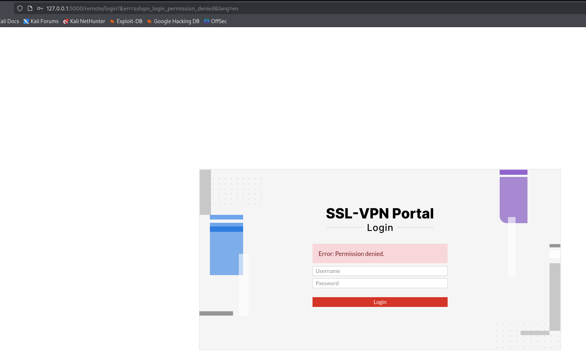

# FortiGate VPN-SSL Honeypot 🛡️

[](../../actions)
[](../../actions)


---


---

## 1 🚀 Introduction

A **deception honeypot** that mimics FortiGate VPN-SSL devices to trap brute force attempts, detect deliberately exfiltrated credentials for counter‑intelligence, and report malicious activity to external intelligence feeds (VT, OTX).

- **Python & Flask** for login portal.
- **Nginx** fronts the portal with TLS.
- **Docker** environment via `docker compose`.
- **SQLite** stores raw telemetry (creds & symlink‑exploit probes).
- A suite of helper scripts automate parsing, reporting, and alerting.

## 📝 Read the blog post to find an example of configuring and running the Honey: [https://pgj11.com/posts/FortiGate-VPN-SSL-Honeypot/](https://pgj11.com/posts/FortiGate-VPN-SSL-Honeypot/)

---

## 2 ️✨ Key Features

| 🚩Feature                       | Description                                                        |
| ---------------------------------- | -------------------------------------------------------------------- |
| 📧**Report to email**           | HTML dashboard with summary of Honeypot traps |
| 🌐**Report to OTX**             | Posts new bad IPs to AlienVault OTX pulses                         |
| 🔍**Report to VT**              | Down‑votes & comments IPs on VirusTotal              |
| 🙈**Counter‑intel**             | Flags any password present in `exfiltrated_passwords.txt` used for counter ingelligence. Deliberately exfiltrate credentials and detect attempts to use them.          |
| ~~⚠️**Symlink exploit detection**~~ | ~~Catches symlink exploit attempts.~~ Unfortunately, as this is not public yet it has been removed. Showing the detection approach would shows also how to exploit it. |

---

## 3 🐳 Main Usage

```bash
# 1. Clone & build
$ git clone https://github.com/PeterGabaldon/Fortigate.VPN-SSL.Honeypot.git
$ cd Fortigate.VPN-SSL.Honeypot-main

# 2. Generate TLS material (one‑off) (Modify certificate data in gen-cert.sh for OPSEC)
$ cd ./nginx/dist/conf/ssl/
$ bash gen-cert.sh

(Ensure that the generated certificates are placed under ./nginx/dist/conf/ssl/)

$ cd ./nginx/dist/conf/ssl/gen-dhparam.sh 2048
$ bash gen-dhparam.sh 2048

(Ensure that the generated dhparam is placed under ./nginx/dist/conf/ssl/)

# 3. Run with docker compose
$ docker compose up # 🔥 boots nginx & honeypot

# 4. Parse logs & load SQLite
$ /bin/bash ./parse.sh   # ➜ data/db/honeypot.db gets populated
```

*The portal will go live on 10443 (host network) by default.*
To change the port, modify `nginx/dist/conf/honey.conf`.
Logins are stored in `data/log/honey/creds.log` until `parse.sh` moves them into SQLite.
Logs of nginx are stored in `data/log/nginx/access.log`.
---



## 4 🛠️ Optional / Prod Deploy

### 4.1 🐍 Virtual‑envs for reporting scripts

The recommended way to use the reporting scripts is installing the dependecies for each one in a venv.

```bash
$ cd report_to_...
$ python -m venv .venv
$ . .venv/bin/activate
$ pip install -r requirements.txt
```

### 4.2 📅 Periodic Parsing via systemd

In the repository there are templates ready to schedule parsing using systemd service and timer (parse_and_report.service.template & parse_and_report.timer.template)

```bash
$ sudo tee /etc/systemd/system/fortihoney-parse.service <<'EOF'
[Unit]
Description=Parse and report FortiGate VPN-SSL Honeypot service

[Service]
User=fortihoney
Group=fortihoney
WorkingDirectory=/home/fortihoney/Fortigate.VPN-SSL.Honeypot/
Type=oneshot
ExecStart=/home/fortihoney/Fortigate.VPN-SSL.Honeypot/parse.sh
ExecStart=-/home/fortihoney/Fortigate.VPN-SSL.Honeypot/report_to_otx/.venv/bin/python3 report_to_otx/report_to_otx.py -c report_to_otx/otx_config/report_to_otx.config.yaml
ExecStart=-/home/fortihoney/Fortigate.VPN-SSL.Honeypot/report_to_otx/.venv/bin/python3 report_to_otx/report_to_otx.py -c report_to_otx/otx_config/report_to_otx.config.symlink.yaml
ExecStart=-/home/fortihoney/Fortigate.VPN-SSL.Honeypot/report_to_vt/.venv/bin/python3 report_to_vt/report_to_vt.py -c report_to_vt/vt_config/report_to_vt_bad_ips.yaml
ExecStart=-/home/fortihoney/Fortigate.VPN-SSL.Honeypot/report_to_vt/.venv/bin/python3 report_to_vt/report_to_vt.py -c report_to_vt/vt_config/report_to_vt_bad_ips.symlink.yaml
EOF

$ sudo tee /etc/systemd/system/fortihoney-parse.timer <<'EOF'
[Unit]
Description=Parse and report FortiGate VPN-SSL Honeypot service timer

[Timer]
OnCalendar=*:0/30
Persistent=true

[Install]
WantedBy=timers.target
EOF

sudo systemctl enable --now fortihoney-parse.timer
```

> **ACL Fix**: the logs are written as `root` (inside the container). Allow the service user write access in order to the parser script (parse.sh) to be able to clear the logs:
>
> ```bash
> sudo setfacl -m u:fortihoney:rw data/log/honey/creds.log data/log/nginx/access.log
> ```

### 4.3 🌐 Report to VirusTotal / OTX / Email 

The reporting scripts use a yaml file for the configuration. Here are the templates that can be found in their corresponding directories.

When reporting to VT/OTX, the datetime of the last successful report is saved to prevent reporting again the same IP addresses.

When reporting to email, the threshold of data to include in the report is selected by the --hours parameter, by default the last 24h of Honeypot data is used.

#### Reporting to VT

```bash
$ cat report_to_vt/vt_config/report_to_vt_bad_ips.yaml.template
vt_api_key: "<YOUR VT API KEY>"
tag: "FortiGate VPN‑SSL Honeypot"        # used for per‑tag state tracking
comment: "IP {ip} was seen bruteforcing FortiGate VPN-SSL at {seen} 🛡️"
honeypot:
  ip_file: "../honeypot_bad_ips.txt"     
```

#### Reporting to Email

```bash
$ cat report_to_email/email_config.yaml.template
subject: "📊 FortiGate VPN-SSL Honeypot – Daily Report"
from: "Honeypot <honeypot@example.com>"   # optional; defaults to username if omitted
to:
  - security@example.com
  - soc@example.com
smtp:
  host: smtp.example.com
  port: 465              # 465 = SMTPS, 587 = STARTTLS, 25 = opportunistic
  username: honeypot@example.com
  password: "s3cr3tP@ssw0rd"
  use_ssl: true          # true ⇒ implicit TLS (465); false ⇒ STARTTLS (587/25)
```

#### Reporting to OTX

```bash
$ cat report_to_otx/otx_config/report_to_otx.config.yaml.template
# config.yaml

otx_api_key: YOUR_OTX_API_KEY_HERE

pulse:
  name: "FortiGate VPN-SSL Honeypot"
  description: "IPs bruteforcing FortiGate VPN-SSL gathered from Honeypot"
  type: "blacklist"     # or "threat", "vulnerability", etc.
  public: true
  tlp: "WHITE"          # TLP: WHITE, GREEN, AMBER, RED

honeypot:
  ip_file: "./honeypot_bad_ips.txt"
```

The following examples uses absolute path to venv, alternatively use `$ . .venv/bin/activate`.

#### Command line usage

Report to VT

```bash
$ /home/fortihoney/Fortigate.VPN-SSL.Honeypot/report_to_vt/.venv/bin/python3 report_to_vt/report_to_vt.py --help
usage: report_to_vt.py [-h] -c CONFIG [--db DB]

Report new malicious IPs to VirusTotal

optional arguments:
  -h, --help            show this help message and exit
  -c CONFIG, --config CONFIG
                        vt_config.yaml path
  --db DB               SQLite DB path
```

Report to OTX

```bash
$ /home/peter/Fortigate.VPN-SSL.Honeypot/report_to_otx/.venv/bin/python3 report_to_otx/report_to_otx.py --help
usage: report_to_otx.py [-h] [-c CONFIG]

Sync honeypot IPs into an OTX Pulse

optional arguments:
  -h, --help            show this help message and exit
  -c CONFIG, --config CONFIG
                        path to YAML config
```

Report to Email

```bash
$ /home/peter/Fortigate.VPN-SSL.Honeypot/report_to_email/.venv/bin/python3 report_to_email/report_to_email.py --help
usage: report_to_email.py [-h] [--config CONFIG] [--hours HOURS] [--template TEMPLATE]

Send honeypot e‑mail report from SQLite data

optional arguments:
  -h, --help           show this help message and exit
  --config CONFIG
  --hours HOURS        Time window (h) – default last 24h
  --template TEMPLATE
```

#### Sample usage


```bash
# VirusTotal (24h window)
$ python /home/fortihoney/Fortigate.VPN-SSL.Honeypot/report_to_vt/.venv/bin/python3 report_to_vt/report_to_vt.py -c report_to_vt/vt_config.yaml

# OTX
$ python /home/fortihoney/Fortigate.VPN-SSL.Honeypot/report_to_otx/.venv/bin/python3 report_to_otx/report_to_otx.py -c report_to_otx/otx_config/report_to_otx.config.yaml

# Email
$ python /home/fortihoney/Fortigate.VPN-SSL.Honeypot/report_to_email/.venv/bin/python3 report_to_email/send_report.py -c report_to_email/email_config.yaml
```

---

## 5 💥 Counter Intel

The honeypot isn’t just for telemetry—it actively **hunts for leaked or deliberately planted passwords** you care about.

1. **Watch-list file**  
   Drop one password per line into `exfiltrated_passwords.txt` at the repo root.  
   Example:
   ```text
   S3cr3tP@ssw0rd
   th1sIsB41t
   ```

The email‐report script loads that watch-list and flags any match during the
selected time-window.

A dedicated table “💥 Exfiltrated Credentials” appears in the email report, showing the IP addresses along with the timestamp that used the credentials that were deliberately exfiltrated.

Ideas to exfiltrate credentials
- Run stealer in a controlled environ
- Write the credentials in pastebin
- Sell the credentials in a forum
- ...

---

## 6 📋 TODO

- [x] Report to OTX
- [x] Report to VT
- [x] Report to Email
- [x] Store data in SQLite and clear logs when donde
- [x] Documentation
- [x] Github Actions - Docker 
- [x] Github Actions - Python
- [ ] Report to AbuseIPDB
- [ ] VT collection
- [x] Detect deliberately exfiltrated credentials
- [ ] ...

Any ideas and PRs are welcome!

---

## 7 ✅ Credits

- T-pot [https://github.com/telekom-security/tpotce](https://github.com/telekom-security/tpotce)

## 8 ☕ Donate

Please consider supporting its development — every coffee fuels more open-source defense!  

[](https://github.com/sponsors/PeterGabaldon)
[](https://www.buymeacoffee.com/petergabaldon)

---
[](https://x.com/PedroGabaldon)
[](https://www.linkedin.com/in/pedro-gabaldon-julia/)


