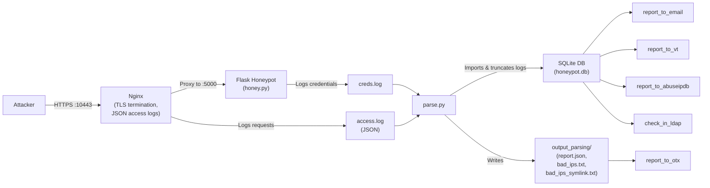
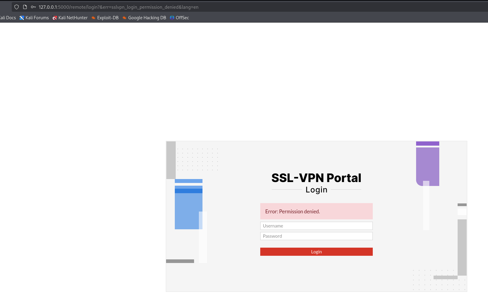

# FortiGate VPN-SSL Honeypot 🛡️

[](../../actions)
[](../../actions)


[](LICENSE)

---


---

## 📝 Read the blog post to find an example of configuring and running the Honey: [https://pgj11.com/posts/FortiGate-VPN-SSL-Honeypot/](https://pgj11.com/posts/FortiGate-VPN-SSL-Honeypot/)

---

## Table of Contents

- [Introduction](#-introduction)
- [Key Features](#-key-features)
- [Architecture & Data Flow](#-architecture--data-flow)
- [Project Structure](#-project-structure)
- [Quick Start](#-quick-start)
  - [From Docker Hub](#from-docker-hub)
  - [Building from Source](#building-from-source)
- [Log Parsing](#-log-parsing-parsepy)
- [Reporting & Alerting](#-reporting--alerting)
  - [Setup (Virtual Environments)](#-setup-virtual-environments)
  - [Report to Email](#-report-to-email)
  - [Report to VirusTotal](#-report-to-virustotal)
  - [Report to OTX](#-report-to-otx)
  - [Report to AbuseIPDB](#-report-to-abuseipdb)
  - [Check Credentials in LDAP](#-check-credentials-in-ldap)
  - [CLI Reference](#-cli-reference)
- [Counter-Intelligence](#-counter-intelligence)
- [Production Deployment](#-production-deployment)
  - [Periodic Parsing via systemd](#-periodic-parsing-via-systemd)
  - [ACL Fix](#acl-fix)
- [Security Considerations](#-security-considerations)
- [TODO](#-todo)
- [License](#-license)
- [Credits](#-credits)
- [Donate](#-donate)

---

## 🚀 Introduction

A **deception honeypot** that mimics FortiGate VPN-SSL devices to trap brute force attempts, detect deliberately exfiltrated credentials for counter‑intelligence, and report malicious activity to external intelligence feeds (VT, OTX, AbuseIPDB).

- **Python & Flask** for a pixel-perfect FortiGate SSL-VPN login portal.
- **Nginx** fronts the portal with TLS and JSON-structured access logs.
- **Docker** environment via `docker compose`.
- **SQLite** stores raw telemetry (credentials & symlink‑exploit probes).
- A suite of helper scripts automate parsing, reporting, and alerting.
- **AI-powered summaries** via OpenRouter LLM integration (optional).

---

## ✨ Key Features

| 🚩 Feature                        | Description                                                                                                                                                          |
| ---------------------------------- | -------------------------------------------------------------------------------------------------------------------------------------------------------------------- |
| 📧 **Report to Email**            | HTML dashboard with summary of Honeypot traps, optional AI-generated executive summary via OpenRouter                                                                |
| 🌐 **Report to OTX**              | Posts new bad IPs to AlienVault OTX pulses                                                                                                                           |
| 🔍 **Report to VT**               | Down‑votes & comments IPs on VirusTotal, optionally adds to VT collections                                                                                          |
| 🛡️ **Report to AbuseIPDB**       | Reports malicious IPs to AbuseIPDB with configurable abuse categories                                                                                                |
| 🔐 **Check in LDAP**              | Validates captured credentials against Active Directory / LDAP and raises high-priority alerts if any are valid                                                      |
| 🙈 **Counter‑intelligence**       | Flags any password present in `exfiltrated_passwords.txt` — deliberately exfiltrate credentials and detect attempts to use them                                      |
| ⚠️ **Symlink exploit detection**  | Catches FortiGate symlink persistence exploit attempts via Nginx logs. [Blog post](https://pgj11.com/posts/FortiGate-Symlink-Attack/)                                |
| 🤖 **LLM Summary**                | Optional AI-generated executive summary in email reports via OpenRouter (any model)                                                                                  |

---

## 🏗️ Architecture & Data Flow


```mermaid
flowchart LR
    A["Attacker"] -->|"HTTPS :10443"| B["Nginx\n(TLS termination,\nJSON access logs)"]
    B -->|"Proxy to :5000"| C["Flask Honeypot\n(honey.py)"]
    C -->|"Logs credentials"| D["creds.log"]
    B -->|"Logs requests"| E["access.log\n(JSON)"]
    D --> F["parse.py"]
    E --> F
    F -->|"Imports & truncates logs"| G["SQLite DB\n(honeypot.db)"]
    F -->|"Writes"| H["output_parsing/\n(report.json,\nbad_ips.txt,\nbad_ips_symlink.txt)"]
    G --> I["report_to_email"]
    G --> J["report_to_vt"]
    G --> K["report_to_abuseipdb"]
    G --> L["check_in_ldap"]
    H --> M["report_to_otx"]
```

1. **Nginx** terminates TLS on port 10443 and reverse-proxies to Flask. It logs all requests in JSON format and passes the real client IP via `X-Real-IP`.
2. **Flask** (`honey.py`) serves a pixel-perfect FortiGate VPN-SSL login page. Every login attempt is logged to `creds.log` (TSV: username, password, IP, timestamp). Login always fails with "Permission denied".
3. **Symlink detection**: Nginx logs requests to `/lang/custom/...` paths (the symlink persistence exploit vector). `parse.py` extracts these into the `symlink_exploits` table.
4. **`parse.py`** reads both log files, inserts records into SQLite, writes output reports, and **truncates the logs** after processing.
5. **Reporters** query the SQLite DB (or output files for OTX) and send data to external services.

---

## 📁 Project Structure

```
Fortigate.VPN-SSL.Honeypot/
├── honey/                          # Flask honeypot app
│   ├── Dockerfile                  # Python 3.14 slim + Flask
│   ├── honey.py                    # Main app (routes, credential capture)
│   ├── requirements.txt            # Flask
│   ├── assets/                     # SVG brand assets
│   ├── css/                        # FortiGate stylesheets
│   ├── fonts/                      # WOFF/WOFF2 fonts
│   └── js/                         # Login JS, language bundle
├── nginx/                          # Nginx reverse proxy
│   └── dist/conf/
│       ├── nginx.conf              # Main config (JSON logging)
│       ├── honey.conf              # Site config (TLS, proxy)
│       └── ssl/                    # TLS cert/key generation scripts
├── parse.py                        # Log parser → SQLite + reports
├── report_to_email/                # Email reporter (+ LLM summary)
├── report_to_vt/                   # VirusTotal reporter
├── report_to_otx/                  # AlienVault OTX reporter
├── report_to_abuseipdb/            # AbuseIPDB reporter
├── check_in_ldap/                  # LDAP credential validator
├── docker-compose.yml              # Build from source
├── docker-compose-hub.yml          # Pull from Docker Hub
├── parse_and_report.service.template  # systemd service template
├── parse_and_report.timer.template    # systemd timer template
├── exfiltrated_passwords.txt       # Counter-intel watch list (create manually)
└── .github/workflows/              # CI: Docker build + Python syntax
```

---

## 🐳 Quick Start

There are two options available: pulling the images from Docker Hub or building from the repository.

### From Docker Hub

⚠️⚠️⚠️
```
The Docker images pushed to the repository contain a preloaded TLS configuration.
The nginx image contains an RSA key pair and DH params configured.
This is necessary for the image to be ready to run.

This has two cons:
1. The Honeypot can be fingerprinted.
2. The private key is known to everyone, so consider the communications to your Honeypot compromised.
```

Because of that I recommend that you modify the TLS configuration in the nginx container or build from the repository.

Use `docker-compose-hub.yml` to get the images from Docker Hub.

- [https://hub.docker.com/r/peterg11/fortigate.vpn-ssl.honeypot](https://hub.docker.com/r/peterg11/fortigate.vpn-ssl.honeypot)

```bash
$ sudo docker compose -f ./docker-compose-hub.yml up
```

### Building from Source

```bash
# 1. Clone & enter repo
$ git clone https://github.com/PeterGabaldon/Fortigate.VPN-SSL.Honeypot.git
$ cd Fortigate.VPN-SSL.Honeypot

# 2. Generate TLS material (one‑off) (Modify certificate data in gen-cert.sh for OPSEC)
$ cd ./nginx/dist/conf/ssl/
$ bash gen-cert.sh
$ bash gen-dhparam.sh 2048

(Ensure that the generated certificates are placed under ./nginx/dist/conf/ssl/)

# 3. Run with docker compose
$ cd ../../../../
$ docker compose up   # 🔥 boots nginx & honeypot

# 4. Parse logs & load SQLite
$ ./parse.py   # ➜ db/honeypot.db gets populated
```

*The portal will go live on port 10443 (host network) by default.*
To change the port, modify `nginx/dist/conf/honey.conf`.
Logins are stored in `data/log/honey/creds.log` until `parse.py` moves them into SQLite.
Nginx access logs are stored in `data/log/nginx/access.log`.

---



---

## 📊 Log Parsing (`parse.py`)

`parse.py` is the central pipeline that moves raw log data into the SQLite database.

**What it does:**

1. Reads `data/log/honey/creds.log` (TSV: username, password, IP, timestamp) and imports into the `honeypot_creds` table.
2. Reads `data/log/nginx/access.log` (JSON), extracts requests to `/lang/custom/...` (symlink exploit attempts), and imports into the `symlink_exploits` table.
3. Writes aggregated output files to `output_parsing/`:
   - `report.json` — Full JSON report with all aggregations.
   - `bad_ips.txt` — Unique IPs with first-seen timestamp.
   - `bad_ips_symlink.txt` — IPs that attempted symlink exploits.
4. **Truncates both log files** after processing.

**Environment variables** (all optional, with defaults):

| Variable      | Default                               | Description                  |
| ------------- | ------------------------------------- | ---------------------------- |
| `LOG_CREDS`   | `data/log/honey/creds.log`            | Path to honeypot creds log   |
| `LOG_NGINX`   | `data/log/nginx/access.log`           | Path to Nginx access log     |
| `REPORT_DIR`  | `output_parsing/`                     | Output directory for reports |
| `DB_DIR`      | `db/`                                 | Directory for SQLite DB      |
| `DB_FILE`     | `db/honeypot.db`                      | SQLite database file path    |

**SQLite schema:**

```sql
-- Captured login attempts
CREATE TABLE honeypot_creds (
  id       INTEGER PRIMARY KEY AUTOINCREMENT,
  user     TEXT,
  password TEXT,
  ip       TEXT,
  ts       TEXT
);

-- Symlink persistence exploit attempts (from Nginx logs)
CREATE TABLE symlink_exploits (
  id   INTEGER PRIMARY KEY AUTOINCREMENT,
  ip   TEXT,
  path TEXT,
  ts   TEXT
);

-- Created by check_in_ldap when valid credentials are found
CREATE TABLE valid_ldap_creds (
  user     TEXT,
  password TEXT,
  ts       TEXT
);
```

---

## 🔔 Reporting & Alerting

### 🐍 Setup (Virtual Environments)

The recommended way to use the reporting scripts is installing the dependencies for each one in a virtual environment.

```bash
$ cd report_to_<service>
$ python3 -m venv .venv
$ . .venv/bin/activate
$ pip install -r requirements.txt
```

Each reporter has its own `requirements.txt`:

| Script             | Dependencies                       |
| ------------------ | ---------------------------------- |
| `report_to_email`  | Jinja2, PyYAML, requests, openrouter |
| `report_to_vt`     | vt-py, PyYAML                      |
| `report_to_otx`    | OTXv2, PyYAML                      |
| `report_to_abuseipdb` | requests, PyYAML                |
| `check_in_ldap`    | ldap3, PyYAML, Jinja2              |

---

### 📧 Report to Email

Sends an HTML email report with honeypot statistics for a configurable time window (default: last 24h).

The email report includes:
- Attempts by IP / by user / by password
- Symlink exploit attempts
- Bad IPs list
- 💥 Exfiltrated credentials (counter-intelligence matches)
- 🚨 Compromised LDAP credentials (if `check_in_ldap` has been run)
- 🤖 AI-generated executive summary (optional, via OpenRouter)

**Configuration template** (`report_to_email/email_config.yaml.template`):

```yaml
# LLM Summary (optional – leave openrouter_api_key empty to disable)
openrouter_api_key: ""
openrouter_model: "openai/gpt-3.5-turbo"
system_prompt: "You are a cybersecurity analyst. Summarize the following honeypot data..."

subject: "📊 FortiGate VPN-SSL Honeypot – Daily Report"
from: "Honeypot <honeypot@example.com>"   # optional; defaults to username if omitted
to:
  - security@example.com
  - soc@example.com
smtp:
  host: smtp.example.com
  port: 465              # 465 = SMTPS, 587 = STARTTLS, 25 = opportunistic
  username: honeypot@example.com
  password: "s3cr3tP@ssw0rd"
  use_ssl: true          # true ⇒ implicit TLS (465); false ⇒ STARTTLS (587/25)
```

The **LLM summary** uses [OpenRouter](https://openrouter.ai/) to generate an AI executive summary of the honeypot data. You can use any model available on OpenRouter (e.g., `openai/gpt-4o`, `anthropic/claude-sonnet-4`, `google/gemini-2.5-flash`). Leave `openrouter_api_key` empty to disable this feature.

The email template can be customized by editing `report_to_email/email_template.html.jinja`.

---

### 🔍 Report to VirusTotal

Down-votes IPs as malicious and posts comments on VirusTotal. Optionally adds IPs to a VT collection. Uses a per-tag state file to avoid re-reporting.

**Configuration template** (`report_to_vt/vt_config/report_to_vt_bad_ips.yaml.template`):

```yaml
vt_api_key: "<YOUR VT API KEY>"
tag: "FortiGate VPN‑SSL Honeypot"        # used for per‑tag state tracking
comment: "IP {ip} was seen bruteforcing FortiGate VPN-SSL at {seen} 🛡️"
collection_id: ""                         # optional: VT collection ID to add IPs to
honeypot:
  ip_file: "../honeypot_bad_ips.txt"
```

---

### 🌐 Report to OTX

Creates or syncs an AlienVault OTX pulse with malicious IPs. If a pulse with the configured name already exists, new IPs are added as indicators; otherwise a new pulse is created.

**Configuration template** (`report_to_otx/otx_config/report_to_otx.config.yaml.template`):

```yaml
otx_api_key: YOUR_OTX_API_KEY_HERE

pulse:
  name: "FortiGate VPN-SSL Honeypot"
  description: "IPs bruteforcing FortiGate VPN-SSL gathered from Honeypot"
  type: "blacklist"     # or "threat", "vulnerability", etc.
  public: true
  tlp: "WHITE"          # TLP: WHITE, GREEN, AMBER, RED

honeypot:
  ip_file: "./honeypot_bad_ips.txt"
```

---

### 🛡️ Report to AbuseIPDB

Reports malicious IPs to AbuseIPDB with configurable abuse categories. Uses a per-tag state file to avoid re-reporting.

**Configuration template** (`report_to_abuseipdb/abuseipdb_config/report_to_abuseipdb.config.yaml.template`):

```yaml
abuseipdb_api_key: "<YOUR ABUSEIPDB API KEY>"
tag: "FortiGate VPN-SSL Honeypot"
comment: "IP {ip} was seen bruteforcing FortiGate VPN-SSL at {seen} 🛡️"
categories: "18,21"
hours: 24
```

---

### 🔐 Check Credentials in LDAP

Validates captured credentials against an Active Directory / LDAP server. If a bind succeeds (meaning the credentials are valid), the script:
1. Stores the valid credentials in the `valid_ldap_creds` SQLite table (picked up by the email reporter as "🚨 Compromised LDAP Credentials").
2. Sends a high-priority alert email immediately.

**Configuration template** (`check_in_ldap/ldap_config/ldap_config.yaml.template`):

```yaml
ldap:
  # LDAP Server URI.
  # - LDAPS is recommended for Windows Active Directory: "ldaps://dc01.example.local:636"
  # - StartTLS is also supported: "ldap://dc01.example.local:389" (with start_tls: true)
  # - Plain LDAP without StartTLS: "ldap://ldap01.example.local:389" (refused by default unless allow_cleartext_simple_bind: true)
  server: "ldaps://dc01.example.local:636"
  
  # Authentication Method: "simple" (default) or "ntlm".
  # NTLM requires pycryptodome installed (pip install pycryptodome) and does not need OpenSSL legacy providers.
  auth_method: "simple"
  
  # For auth_method: "simple"
  domain: "example.local"             # DNS domain name for Simple Bind (e.g. user@domain)
  
  # For auth_method: "ntlm"
  ntlm_domain: "EXAMPLE"              # NetBIOS domain name for NTLM Bind (e.g. DOMAIN\user)
  
  # TLS & Security Configuration
  validate_cert: true                 # Set to false only for testing/lab use to ignore TLS certificate verification
  ca_certs_file: null                 # Path to the CA certificate bundle (PEM format) if using an internal private CA
  start_tls: false                    # Enable StartTLS (must use 'ldap://' and port 389/3268)
  allow_cleartext_simple_bind: false  # Refuses plain 'ldap://' cleartext binds if false. Enable only for OpenLDAP or lab use.
  timeout: 10                         # Connection timeout in seconds

  # Rate limiting and account lockout protection
  max_failures_per_user: 3       # Max allowed failed LDAP binds per user in the tracking window
  lockout_window_seconds: 86400  # Tracking window in seconds (e.g., 86400 for 24 hours)

alert_email:
  subject: "🚨 HIGH ALERT: Valid Credentials Compromised!"
  from: "honeypot@example.com"
  to:
    - soc@example.com
  smtp_host: "smtp.example.com"
  smtp_port: 587
  smtp_user: "honeypot@example.com"
  smtp_pass: "secret"
  use_ssl: false
```

---

### 💻 CLI Reference

The following examples use absolute paths to the venv Python. Alternatively, activate the venv first with `. .venv/bin/activate`.

**Report to Email**

```bash
$ report_to_email/.venv/bin/python3 report_to_email/report_to_email.py --help
usage: report_to_email.py [-h] [--config CONFIG] [--hours HOURS] [--template TEMPLATE]

Send honeypot e‑mail report from SQLite data

optional arguments:
  -h, --help           show this help message and exit
  --config CONFIG
  --hours HOURS        Time window (h) – default last 24h
  --template TEMPLATE
```

**Report to VirusTotal**

```bash
$ report_to_vt/.venv/bin/python3 report_to_vt/report_to_vt.py --help
usage: report_to_vt.py [-h] -c CONFIG [--db DB]

Report new malicious IPs to VirusTotal

optional arguments:
  -h, --help            show this help message and exit
  -c CONFIG, --config CONFIG
                        vt_config.yaml path
  --db DB               SQLite DB path
```

**Report to OTX**

```bash
$ report_to_otx/.venv/bin/python3 report_to_otx/report_to_otx.py --help
usage: report_to_otx.py [-h] [-c CONFIG]

Sync honeypot IPs into an OTX Pulse

optional arguments:
  -h, --help            show this help message and exit
  -c CONFIG, --config CONFIG
                        path to YAML config
```

**Report to AbuseIPDB**

```bash
$ report_to_abuseipdb/.venv/bin/python3 report_to_abuseipdb/report_to_abuseipdb.py --help
usage: report_to_abuseipdb.py [-h] -c CONFIG [--db DB]

Report new malicious IPs to AbuseIPDB

optional arguments:
  -h, --help            show this help message and exit
  -c CONFIG, --config CONFIG
                        abuseipdb config path
  --db DB               SQLite DB path
```

**Check in LDAP** (no CLI arguments – uses config file at `check_in_ldap/ldap_config/ldap_config.yaml`):

```bash
$ check_in_ldap/.venv/bin/python3 check_in_ldap/check_ldap.py
```

#### Sample Usage

```bash
# Parse logs into SQLite
$ ./parse.py

# Email report (last 24h)
$ report_to_email/.venv/bin/python3 report_to_email/report_to_email.py --config report_to_email/email_config.yaml

# VirusTotal
$ report_to_vt/.venv/bin/python3 report_to_vt/report_to_vt.py -c report_to_vt/vt_config/report_to_vt_bad_ips.yaml

# OTX
$ report_to_otx/.venv/bin/python3 report_to_otx/report_to_otx.py -c report_to_otx/otx_config/report_to_otx.config.yaml

# AbuseIPDB
$ report_to_abuseipdb/.venv/bin/python3 report_to_abuseipdb/report_to_abuseipdb.py -c report_to_abuseipdb/abuseipdb_config/report_to_abuseipdb.config.yaml

# LDAP Check
$ check_in_ldap/.venv/bin/python3 check_in_ldap/check_ldap.py
```

---

## 💥 Counter-Intelligence

The honeypot isn't just for telemetry—it actively **hunts for leaked or deliberately planted passwords** you care about.

1. **Watch-list file**
   Drop one password per line into `exfiltrated_passwords.txt` at the repo root.
   Example:
   ```text
   S3cr3tP@ssw0rd
   th1sIsB41t
   ```

The email‐report script loads that watch-list and flags any match during the
selected time-window.

A dedicated table "💥 Exfiltrated Credentials" appears in the email report, showing the IP addresses along with the timestamp that used the credentials that were deliberately exfiltrated.

Ideas to exfiltrate credentials:
- Run stealer in a controlled environment
- Write the credentials in pastebin
- Sell the credentials in a forum
- ...

---

## ⚙️ Production Deployment

### 📅 Periodic Parsing via systemd

In the repository there are templates ready to schedule parsing using systemd service and timer (`parse_and_report.service.template` & `parse_and_report.timer.template`).

```bash
$ sudo tee /etc/systemd/system/fortihoney-parse.service <<'EOF'
[Unit]
Description=Parse and report FortiGate VPN-SSL Honeypot service

[Service]
User=fortihoney
Group=fortihoney
WorkingDirectory=/home/fortihoney/Fortigate.VPN-SSL.Honeypot/
Type=oneshot
ExecStart=/home/fortihoney/Fortigate.VPN-SSL.Honeypot/parse.py
ExecStart=-/home/fortihoney/Fortigate.VPN-SSL.Honeypot/report_to_otx/.venv/bin/python3 report_to_otx/report_to_otx.py -c report_to_otx/otx_config/report_to_otx.config.yaml
ExecStart=-/home/fortihoney/Fortigate.VPN-SSL.Honeypot/report_to_otx/.venv/bin/python3 report_to_otx/report_to_otx.py -c report_to_otx/otx_config/report_to_otx.config.symlink.yaml
ExecStart=-/home/fortihoney/Fortigate.VPN-SSL.Honeypot/report_to_vt/.venv/bin/python3 report_to_vt/report_to_vt.py -c report_to_vt/vt_config/report_to_vt_bad_ips.yaml
ExecStart=-/home/fortihoney/Fortigate.VPN-SSL.Honeypot/report_to_vt/.venv/bin/python3 report_to_vt/report_to_vt.py -c report_to_vt/vt_config/report_to_vt_bad_ips.symlink.yaml
EOF

$ sudo tee /etc/systemd/system/fortihoney-parse.timer <<'EOF'
[Unit]
Description=Parse and report FortiGate VPN-SSL Honeypot service timer

[Timer]
OnCalendar=*:0/30
Persistent=true

[Install]
WantedBy=timers.target
EOF

sudo systemctl enable --now fortihoney-parse.timer
```

### ACL Fix

The logs are written as `root` (inside the container). Allow the service user write access in order for the parser script (`parse.py`) to be able to clear the logs:

```bash
sudo setfacl -m u:fortihoney:rw data/log/honey/creds.log data/log/nginx/access.log
```

---

## 🔒 Security Considerations

- **Read-only containers**: Both Docker containers run with `read_only: true` for defense in depth.
- **Input sanitization**: The honeypot sanitizes all captured inputs before logging (prevents log injection and shell metacharacter attacks). IP addresses are validated with a strict regex.
- **Security headers**: All responses include HSTS, CSP, X-Frame-Options, X-Content-Type-Options, and X-XSS-Protection headers.
- **Network isolation**: The Flask app only binds to `127.0.0.1:5000` and is only accessible through the Nginx reverse proxy.
- **Secrets management**: Never commit API keys, SMTP/LDAP credentials, generated TLS private keys, SQLite databases, or production logs. Start from `*.template` config files and keep real configs local.
- **TLS material**: If using Docker Hub images, replace the bundled TLS certificates and keys for production deployment to avoid fingerprinting and key exposure.

---

## 📋 TODO

- [x] Report to OTX
- [x] Report to VT
- [x] Report to Email
- [x] Store data in SQLite and clear logs when done
- [x] Documentation
- [x] Github Actions - Docker
- [x] Github Actions - Python
- [x] Report to AbuseIPDB
- [x] VT collection
- [x] Detect deliberately exfiltrated credentials
- [x] Check credentials in LDAP and raise High Alert
- [x] Report summary with LLM (OpenRouter)
- [x] In some cases, _jq_ may fail if so many credentials are to parse
- [ ] ...

Any ideas and PRs are welcome!

---

## 📄 License

This project is licensed under the [MIT License](LICENSE).

---

## ✅ Credits

- T-pot [https://github.com/telekom-security/tpotce](https://github.com/telekom-security/tpotce)

## ☕ Donate

Please consider supporting its development — every coffee fuels more open-source defense!

[](https://github.com/sponsors/PeterGabaldon)
[](https://www.buymeacoffee.com/petergabaldon)

---
[](https://x.com/PedroGabaldon)
[](https://www.linkedin.com/in/pedro-gabaldon-julia/)
